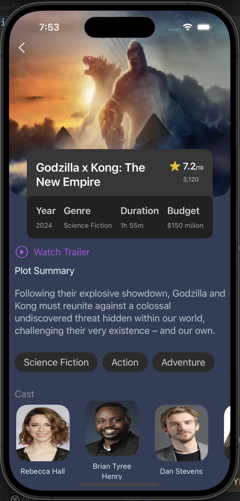

# MovieMate

<!-- 

  

 -->
<!-- 

  

 -->

  

  <a href="https://drive.google.com/file/d/1IYSN3gQTmPgAFDBUGE6I_-hSIG2tQ74f/view" target="_blank" style="display: inline-flex; align-items: center;">
    <!--  -->

  
   <Text>Watch Video </Text>
  </a>
 

MovieMate is a user-friendly application that provides an engaging way to explore movies. With MovieMate, you can search for movies, view detailed information, watch trailers, check ratings, read summaries, and see cast information—all in one place.

## Features

### 1. Search Functionality
Efficiently search for movies by title, genre, or actor, ensuring that you can locate your favorite films without any hassle.
<!-- 

  

 -->

### 2. Movie Details
Access comprehensive details about each movie, including:
- Synopsis
- Cast
- Director
- Genres
- Budget

  

<!-- 

  

 -->

### 3. Watch Trailers
Watch movie trailers directly within the application to get a sneak peek of the films.

### 4. Ratings
View ratings for each movie to help decide whether a movie is worth watching.

### 5. Summary
Read concise summaries of each movie to get a quick overview of the plot.

<!-- 

  

 -->

### 6. Cast Information
See detailed information about the cast, including their roles and other movies they have been a part of.

<!-- 

  

 -->

### Notes

This app can be a valuable reference for developers looking to build similar  applications, providing a well-designed UI and a variety of features.

Note: I have not uploaded the entire project to GitHub for security reasons. If you need my project urgently, please email me at mehediakbar9@gmail.com.